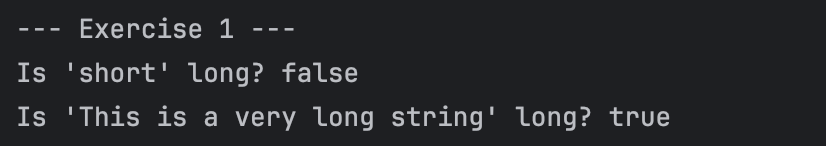
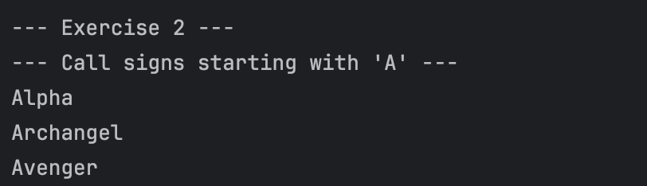
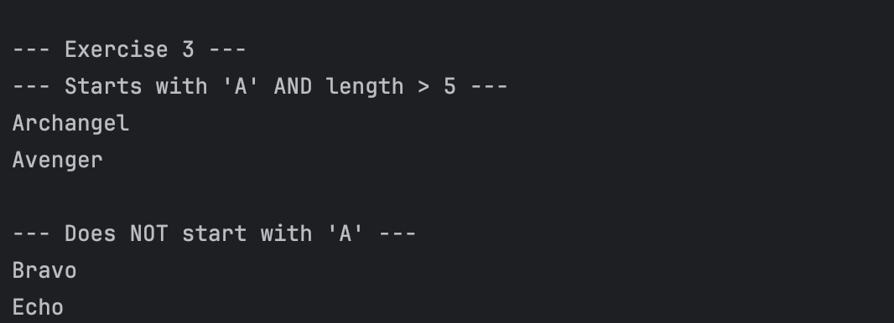

# JC-Exploring-LambdasAndPredicate
**Name:** Nuan Patricia Serrano  
**Project Title:** Exploring Java Lambdas and Predicate 
**Screenshot:**
- Exercise 1: The "New Way" - A Simple Lambda Expression  
    
- Exercise 2: Using Predicates to Filter a List  
    
- Exercise 3: Chaining Predicates (and, negate)  
    